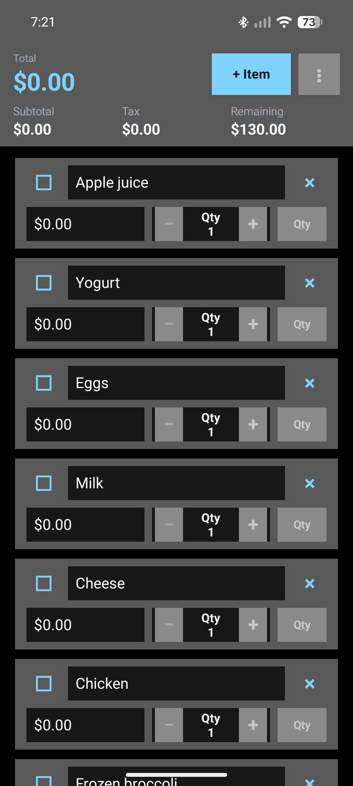
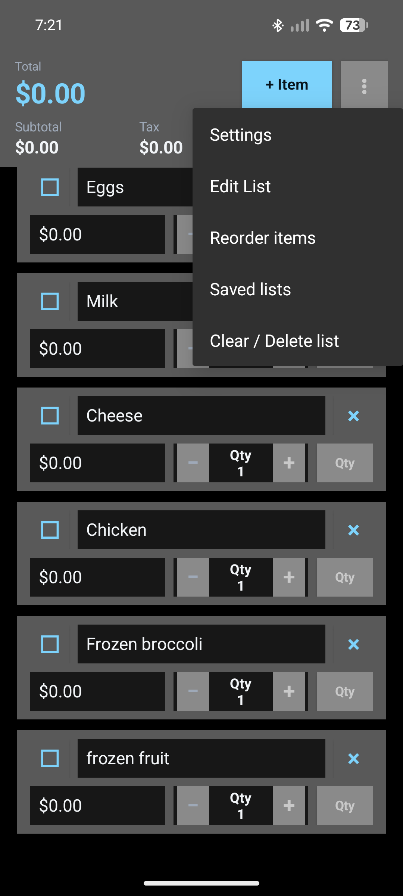
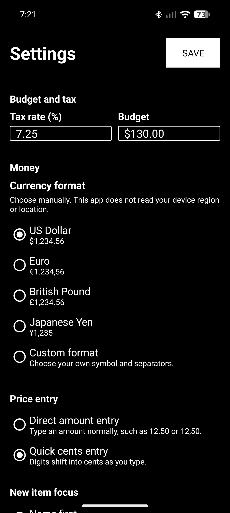
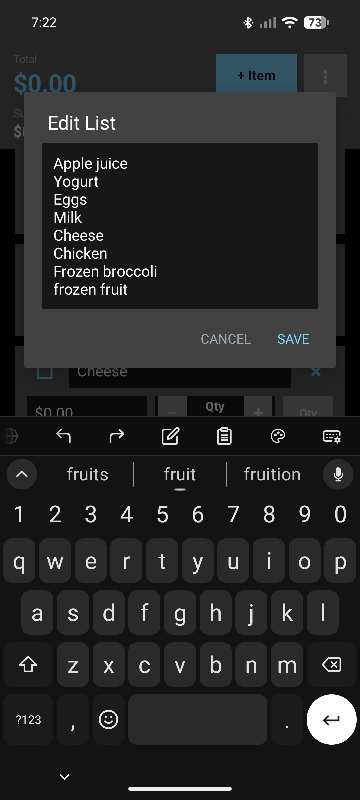
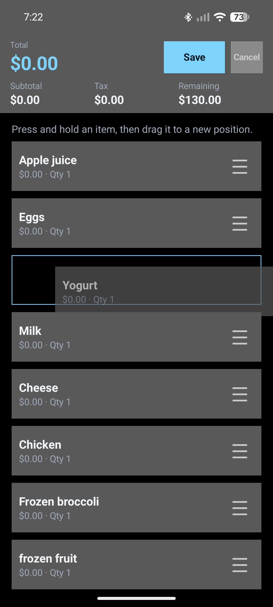
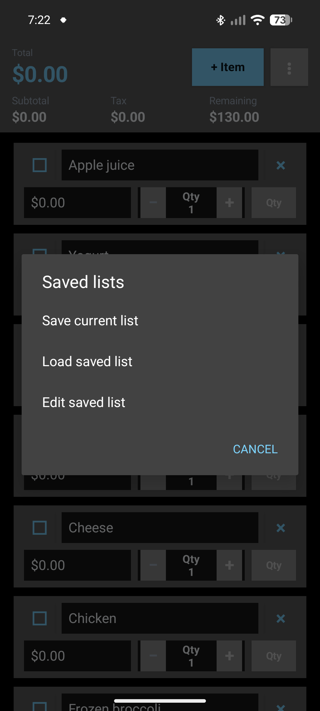
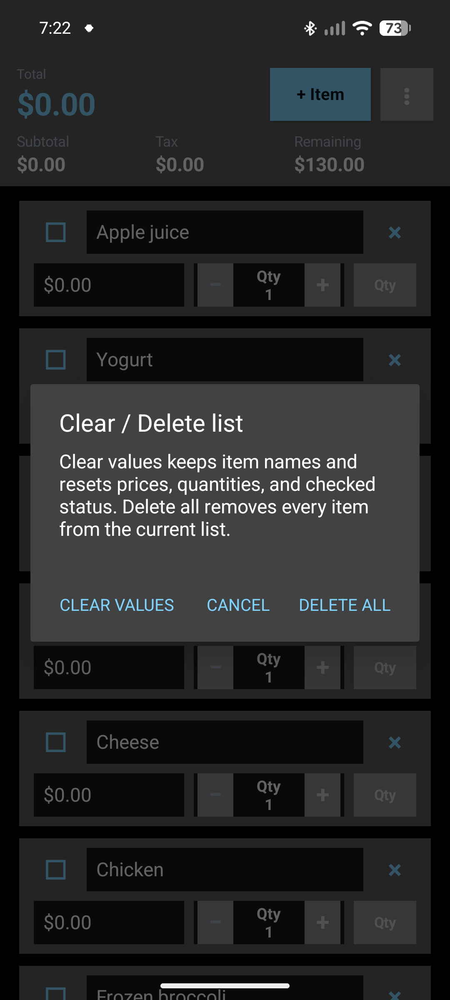

# Shopping List Calculator

Shopping List Calculator is a small, offline Android app for planning a grocery run
and keeping a running total while you shop. Add the items you need, set a
budget and tax rate, then fill in prices and quantities as items go into your
cart.

It is designed for people who want a focused shopping tool without an account,
ads, cloud sync, or a long list of unnecessary features.

## What it does

- Builds a shopping list you can drag to reorder, with edge scrolling for longer lists.
- Saves named list templates you can load, overwrite, rename, edit, or delete.
- Loads saved item names by adding them to the current list or replacing it.
- Tracks item prices and quantities, including weight-based prices per pound,
  kilogram, ounce, or gram.
- Keeps a live subtotal, sales tax, total, and remaining budget.
- Offers US dollar, euro, British pound, Japanese yen, and custom currency formats,
  including symbol placement, decimal places, and separators.
- Supports direct price entry or quick cents entry, where digits shift into the
  fractional amount as you type.
- Lets new items start at the name or price field, with Enter/Next after a price
  to add another item.
- Keeps completed items compact and easy to reopen and edit.
- Clears trip values while keeping item names, or deletes the current list.
- Uses a native dark interface without an account, ads, analytics, or cloud sync.

### Saved lists

Open **Saved lists** from the menu to save the current item names as a named
list, load a saved list, or edit one. Templates store **item names only**, not
prices, quantities, weight modes, or checked status.

**Add to current** appends the saved names without changing existing items.
**Replace current** discards the current items and their trip values and starts
with the saved names. Loaded items start unchecked, with quantity 1 and no price.
Editing or deleting a saved template does not change the current shopping list.

## Screenshots

<p align="center">
  
  
  
</p>

<p align="center">
  
  
  
</p>

<p align="center">
  
</p>

## Privacy and data

Shopping List Calculator works offline.

- It does not require an account or collect personal information.
- It has no internet permission, analytics, ads, or third-party app dependencies.
- Your current list, saved templates, budget, tax rate, and entry/format settings
  stay on the device.
- Android backup is disabled for the app. Uninstalling the app removes its local data.

## Install

Download Shopping List Calculator from
[F-Droid](https://f-droid.org/packages/io.github.buildsbyben.shoppinglistcalc).

You can also build the app from source or install a release APK you trust.

Because Android requires an APK to be signed, an app installed from a different
source or signed with a different key may need to be uninstalled before Android
will accept it as an update. Make a separate note of any information you want to keep before uninstalling;
the app does not currently provide an export feature.

## Build from source

This is a standard Android Gradle project. It has no third-party app
dependencies.

### Requirements

- JDK 17 or newer
- Android SDK Platform 35
- `ANDROID_HOME` set to the Android SDK directory

### Debug build

```bash
./gradlew assembleDebug
```

The debug APK is written to:

```text
app/build/outputs/apk/debug/app-debug.apk
```

### Release build

Release signing material is intentionally not stored in this repository. To build
an unsigned release, leave the signing environment variables unset and run:

```bash
./gradlew assembleRelease
```

The release APK is written to:

```text
app/build/outputs/apk/release/app-release-unsigned.apk
```

To sign your own release, provide `SHOPPING_CALC_STORE_FILE`,
`SHOPPING_CALC_STORE_PASSWORD`, `SHOPPING_CALC_KEY_ALIAS`, and
`SHOPPING_CALC_KEY_PASSWORD` through your local environment. The signed output is
`app/build/outputs/apk/release/app-release.apk`. Never commit signing material.
Debug builds use the `.dev` package suffix and can coexist with the release app.

## F-Droid listing maintenance

F-Droid listing text and images live in `fastlane/metadata/android/en-US/`:

- `short_description.txt` and `full_description.txt`: summary and feature list.
- `changelogs/<versionCode>.txt`: release-specific “What's new” text.
- `images/phoneScreenshots/`: numbered listing screenshots, in display order.
- `images/featureGraphic.png`: 1024 × 500 cover banner for supported F-Droid clients.

README screenshots are separate files in `docs/screenshots/`; update both sets
when refreshing the app screenshots.

Version 2.1 uses version code 16 and `changelogs/16.txt`. For future releases,
assign a new version name and an unused, increasing version code in
`app/build.gradle`, then add a matching changelog. Keep published changelogs
unchanged. Listing updates become available through F-Droid's release processing,
not simply by pushing a branch.

## Project details

- Android package: `io.github.buildsbyben.shoppinglistcalc`
- Minimum Android version: Android 6.0 (API 23)
- License: [MIT](LICENSE)

## Contributing

Bug reports, feature ideas, and small improvements are welcome through
[GitHub Issues](https://github.com/buildsbyben/shopping-list-calc/issues).
