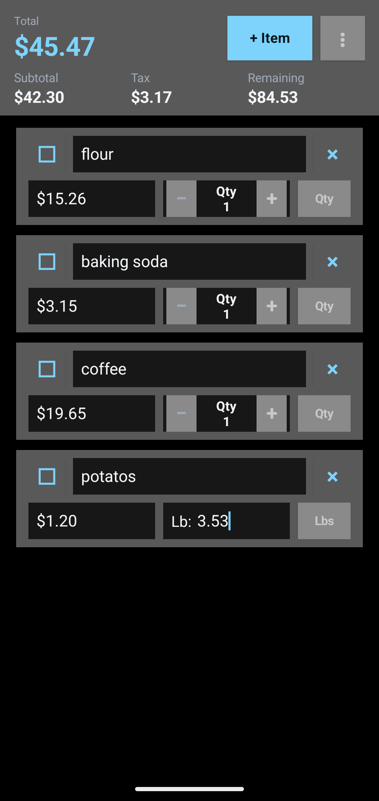
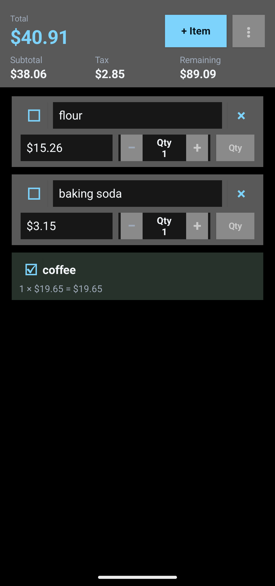
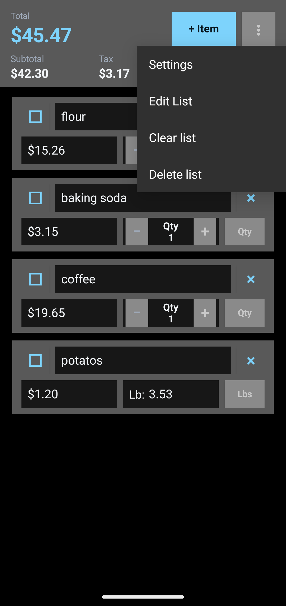
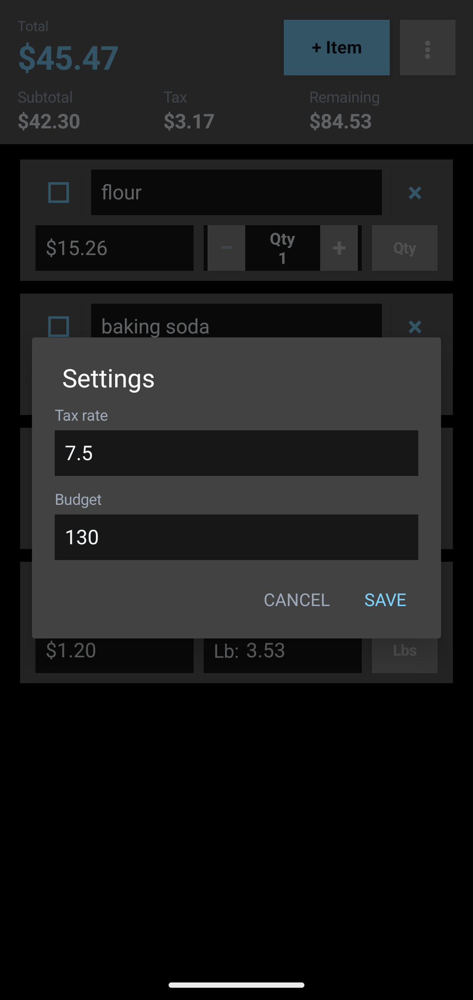
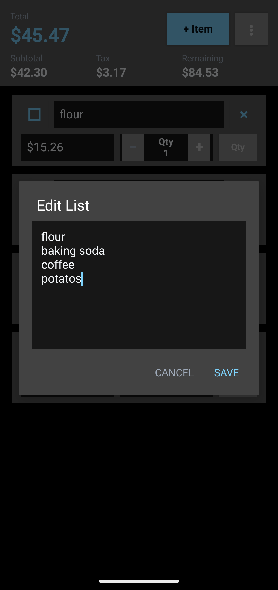

# Shopping List Calculator

Shopping List Calculator is a small, offline Android app for planning a grocery run
and keeping a running total while you shop. Add the items you need, set a
budget and tax rate, then fill in prices and quantities as items go into your
cart.

It is designed for people who want a focused shopping tool without an account,
ads, cloud sync, or a long list of unnecessary features.

## What it does

- Builds a reusable shopping list, ordered to match the way you move through a store.
- Tracks item price and quantity, with separate quantity and weight modes.
- Calculates weight-based items from price per pound and entered pounds.
- Keeps a live subtotal, sales tax, total, and remaining budget.
- Lets you mark completed items as in the cart, reducing clutter while keeping
  them easy to edit.
- Includes simple controls to edit the list, change the budget or tax rate,
  clear a trip, or start a new list.
- Uses a native dark interface that works well for quick one-handed updates.

## Screenshots

<p align="center">
  
  
  
</p>

<p align="center">
  
  
</p>

## Privacy and data

Shopping Calculator is offline-first.

- It does not require an account or collect personal information.
- It has no internet permission, analytics, ads, or third-party app dependencies.
- Your list, budget, and tax-rate settings stay on the device.
- Android backup is disabled for the app. Uninstalling the app removes its local data.

## Install

F-Droid availability is planned. Until then, you can build the app from source
or install a release APK you trust.

Because Android requires an APK to be signed, an app installed from a different
source or signed with a different key may need to be uninstalled before Android
will accept it as an update. Export or note any information you want to keep
before uninstalling.

## Build from source

This is a standard Android Gradle project. It has no third-party app
dependencies.

### Requirements

- JDK 17 or newer
- Android SDK Platform 35
- `ANDROID_HOME` set to the Android SDK directory

### Debug build

```bash
./gradlew assembleDebug
```

The debug APK is written to:

```text
app/build/outputs/apk/debug/app-debug.apk
```

### Release build

Release signing material is intentionally not stored in this repository. Provide
your own signing-key path, passwords, and alias through the signing environment
variables expected by `app/build.gradle`, then run:

```bash
./gradlew assembleRelease
```

The release APK is written to:

```text
app/build/outputs/apk/release/app-release.apk
```

## Project details

- Android package: `io.github.buildsbyben.shoppinglistcalc`
- Minimum Android version: Android 6.0 (API 23)
- License: [MIT](LICENSE)

## Contributing

Bug reports, feature ideas, and small improvements are welcome through
[GitHub Issues](https://github.com/buildsbyben/shopping-list-calc/issues).
